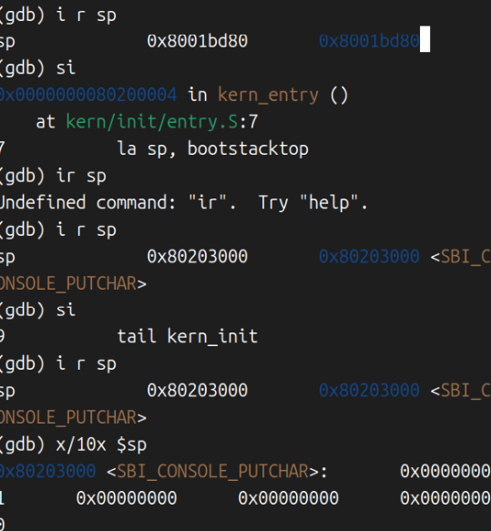

# 操作系统 实验1


## 练习1：理解内核启动中的程序入口操作

阅读 kern/init/entry.S内容代码，结合操作系统内核启动流程，说明指令 la sp, bootstacktop 完成了什么操作，目的是什么？ tail kern_init 完成了什么操作，目的是什么？


### 解答：

kern/init/entry.S的内容

```SAS
#include <mmu.h>
#include <memlayout.h>

    .section .text,"ax",%progbits
    .globl kern_entry
kern_entry:
    la sp, bootstacktop

    tail kern_init

.section .data
    # .align 2^12
    .align PGSHIFT
    .global bootstack
bootstack:
    .space KSTACKSIZE
    .global bootstacktop
bootstacktop:
```


操作系统内核启动流程：

1.qemu模拟一个独立的机器，能够模拟机器的输入输出，但是没有操作系统，我们要自己写

2.高版本的qemu自带OPENSBI（或者自己下载）,opensbi作为一个加载器。它既负责管理高级的操作（比如：打印），又负责把指针指向我们写的操作系统代码入口。

3.在tools/kernel.ld中，指明了操作系统的入口为kernel_entry，并且在ld中就已经进行了空间管理。

4.在操作系统代码开始执行前，必须先建立一个有效的运行环境。就是在汇编代码中**为即将运行的C函数准备一个栈空间**，主要是通过**初始化栈指针`sp`**来完成。

5.entry.s里面就是使用分配好的空间，设置sp


先看头文件：

```python
#include <mmu.h>#定义了一页是多少byte
#include <memlayout.h>#定义一个栈帧占了2页
```


之后：

`.section .text, "ax", %progbits`

定义一个区域，可以执行的，可分配可执行，包含具体的程序执行的数据


#### 重要的1

`kern_entry: `
    `la sp, bootstacktop`

- la: 加载地址

- sp：栈顶指针

- bootstacktop是什么呢？我们看后面


`bootstack:
    .space KSTACKSIZE
    .global bootstacktop
bootstacktop:`

- 当一个栈分完之后，再下面定义了一个bootstacktop:，就是栈顶。


也就是把栈顶的位置复制给SP指针。


#### 重要的2

` tail kern_init`,就类似于跳转到 kern_init 这个位置


我们来看kern_init这个位置执行了什么操作

```
#include <stdio.h>
#include <string.h>
#include <sbi.h>
int kern_init(void) __attribute__((noreturn));

int kern_init(void) {
    extern char edata[], end[];
    memset(edata, 0, end - edata);

    const char *message = "(THU.CST) os is loading ...\n";
    cprintf("%s\n\n", message);
   while (1)
        ;
}
```

  memset(edata, 0, end - edata);清理.bss段未初始化的全局变量（一种规范）

就是打印"(THU.CST) os is loading ...\n"，over


#### 补充：代码书写顺序不等于执行顺序

.s代码当中只执行text段，而data段只是声明，并给两端起了名字


## 练习2： 使用GDB验证启动流程

为了熟悉使用 QEMU 和 GDB 的调试方法，请使用 GDB 跟踪 QEMU 模拟的 RISC-V 从加电开始，直到执行内核第一条指令（跳转到 0x80200000）的整个过程。通过调试，请思考并回答：RISC-V 硬件加电后最初执行的几条指令位于什么地址？它们主要完成了哪些功能？请在报告中简要记录你的调试过程、观察结果和问题的答案。


### 完整过程1：

1. qemu启动
2. 启动gdb
3. b *kernel_entry
4. c
5. 打印出os is loading


### 完整过程2：



这一次我重点关注了sp，发现他在 la sp bootstacktop这一步sp指针发生了改变

203000-01bd80 =这么大我也不知道是什么东西（晕）。


## 实验与OS原理


1. 首先，在分配页表的时候，分配了4096个byte，也就是2^12个，这在课堂上讲过
2. 操作系统负责管理栈帧，这在实验的 .ld 文件上也有所体现
3. `.align PGSHIFT` 确保栈按页对齐。这个对齐在课堂上也有所体现，为了管理的方便


## 实验上很重要但是没有体现的


1.就是要先有riscv的编译链，才能运行qemu

2.特权级别，这个SBI是最高级的，内核是权限稍微低一点的，SBI作为一个接口

3.`kernel.ld` (链接器脚本指定入口) ，这个非常重要，但是课堂上没有体现（我印象不深刻）

4.内存调试中，要一个端口qemu，一个端口GDB


