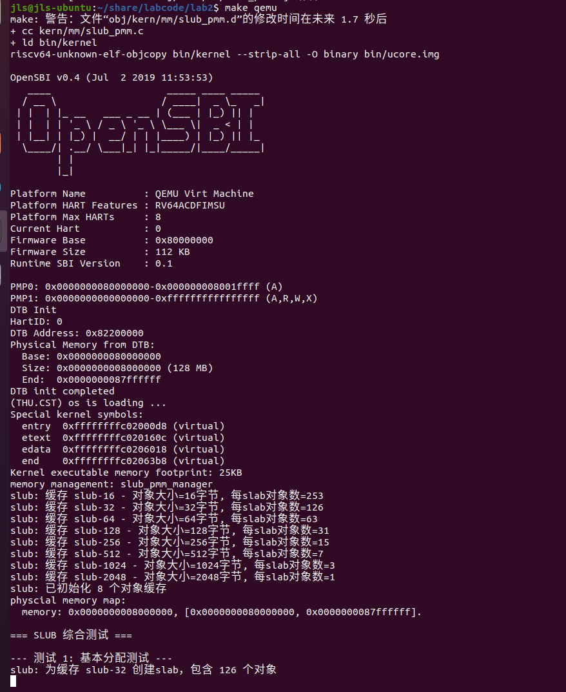
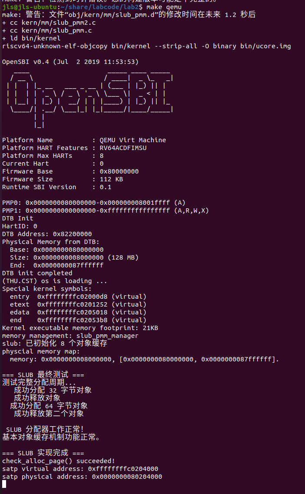

# 实验二：物理内存管理 实验报告


---

## 一、 实验目的与内容摘要

本次实验的核心目标是深入理解并亲手实现操作系统的物理内存管理机制。在实验一构建的可启动内核基础上，本次实验为操作系统赋予了管理物理内存的核心能力，是构建现代操作系统内存管理体系的基石。

实验内容主要包括：
1.  **理解与实现连续物理内存分配算法**：
    *   深入分析了实验框架中提供的 `First-Fit` (首次适应) 算法的实现原理。
    *   动手编程实现了 `Best-Fit` (最佳适应) 算法，并通过了测试。
2.  **理解分页机制与页表的初步建立**：
    *   学习了 RISC-V SV39 分页机制，包括三级页表结构、页表项（PTE）格式以及 `satp` 寄存器的作用。
    *   通过汇编代码在内核启动早期建立了初始页表，成功将内核映射到高地址虚拟空间，并开启了分页模式。
3.  **挑战练习：实现高级内存分配算法**：
    *   作为核心挑战，完整设计并实现了一个基于**完全二叉树**的**伙伴系统 (Buddy System)** 内存分配器以及slub分配器，并通过了全面的测试用例验证。

通过本次实验，我掌握了从探测物理内存、建立管理结构，到实现多种分配算法，再到开启分页机制的全过程，对操作系统如何从零开始掌控计算机内存资源有了具体而深刻的认识。

## 二、 知识点梳理

### 2.1 实验知识点与OS原理的对应关系

| 实验中的知识点                         | 对应的OS原理知识点                                    | 我的理解与分析                                               |
| :------------------------------------- | :---------------------------------------------------- | :----------------------------------------------------------- |
| `pmm_manager` 结构体                   | **物理内存管理器** (Physical Memory Manager)          | **含义**: 实验中的 `pmm_manager` 是一个通过函数指针定义的接口，统一了物理内存管理的操作规范（如 `init`, `alloc_pages`, `free_pages`）。OS原理中，物理内存管理器是内核中负责追踪和分配物理内存的抽象模块。<br>**关系**: `pmm_manager` 是OS原理中抽象概念的具体代码实现，体现了面向接口编程的思想，使得底层分配算法（FF, BF, Buddy）可以灵活替换。<br>**差异**: 理论侧重功能和目标（如效率、碎片管理），实验则关注如何用C语言的数据结构和函数指针优雅地实现一个可扩展、可替换的管理器框架。 |
| `Page` 结构体, `free_area_t`           | **空闲空间管理** (位图法, 空闲链表法)                 | **含义**: 实验中使用 `Page` 结构体数组来描述所有物理页的状态，并用 `free_area_t`（内部是一个双向链表 `list_entry_t`）将所有空闲的内存块组织起来。<br>**关系**: 这是OS原理中**空闲链表法 (Free-List)** 的典型实现。`Page` 结构体中的 `property` 字段记录了连续空闲页的数量，`page_link` 则将这些空闲块的头页链接起来。<br>**差异**: 理论上会介绍位图法等多种方法。实验中选择了链表法，因为它在合并相邻空闲块时相对高效。实验代码通过精巧的 `le2page` 宏，实现了从链表节点指针到其宿主结构体指针的转换，这是内核编程中的一个常用技巧。 |
| `First-Fit` / `Best-Fit` 算法          | **动态分区分配算法** (Dynamic Partition Allocation)   | **含义**: First-Fit从头查找第一个足够大的空闲块；Best-Fit遍历所有空闲块，找到大小最接近需求的那个。<br>**关系**: 实验代码 `default_pmm.c` 和我们实现的 `best_fit_pmm.c` 分别是这两种经典算法的直接代码翻译。其 `free_pages` 函数中的**合并（Coalescing）**逻辑也是理论的重点，即检查并合并前后相邻的空闲块以减少外部碎片。<br>**差异**: 理论分析常关注算法的时空复杂度和碎片化倾向。实验中，我们需要关注链表操作、边界条件和指针运算等具体实现细节。 |
| `entry.S`中建立页表, `satp`寄存器, PTE | **分页内存管理** (Paging), **地址转换**, **多级页表** | **含义**: 实验中我们手动构建了一个三级页表，利用了1GiB大页映射特性，将高虚拟地址映射到物理地址。然后将页表基地址写入 `satp` 寄存器并刷新TLB，从而开启分页。<br>**关系**: 这完美复现了OS原理中启动分页机制的过程。它展示了从物理地址模式切换到虚拟地址模式的关键步骤，以及多级页表如何通过大页特性提高效率和节省页表空间。<br>**差异**: 理论上讲解地址翻译过程（VPN -> PPN），而实验则需要我们深入到汇编层面，直接操作 `satp` 等控制寄存器和使用 `sfence.vma` 等特权指令，让我们对硬件与软件的交互有了更深刻的体会。 |

### 2.2 OS原理中重要但在实验中未体现的知识点

- **虚拟内存 (Virtual Memory)**: 本实验只实现了内核的虚拟地址映射，尚未实现用户进程独立的地址空间，以及按需分页（Demand Paging）、页面置换（Page Replacement）等完整的虚拟内存机制。
- **页面置换算法 (Page Replacement Algorithms)**: 当物理内存耗尽时，需要选择一个页面换出到磁盘。本实验不涉及此场景，因此LRU、Clock等经典算法没有体现。
- **写时复制 (Copy-on-Write)**: `fork()` 系统调用中的一项关键优化技术，在创建子进程时共享父进程的只读页面，直到需要写入时才真正复制。
- **交换空间 (Swap Space)**: 用于存储被换出页面的磁盘空间，以及相关的管理机制。

## 三、 练习解答

### 练习1：理解 first-fit 连续物理内存分配算法

#### 设计实现过程分析

`First-Fit` 算法在 `kern/mm/default_pmm.c` 中实现，其核心是维护一个按物理地址升序排列的空闲内存块链表 `free_list`。

- **`default_init()`**: 初始化内存管理器，将 `free_list` 初始化为空链表，空闲页计数器 `nr_free` 置零。
- **`default_init_memmap(struct Page *base, size_t n)`**: 接收一块连续的物理内存区域（由 `base` 和 `n` 描述），将其作为一个大的空闲块加入到 `free_list` 中。它会设置头页 `base` 的 `property` 字段为块大小 `n`，并设置 `PG_property` 标志。插入时会保持链表的地址有序性。
- **`default_alloc_pages(size_t n)`**:
    1.  从 `free_list` 的头部开始**顺序遍历**。
    2.  寻找**第一个**大小（`property`）不小于 `n` 的空闲块。
    3.  找到后，如果块大小正好等于 `n`，则将其从链表中移除。
    4.  如果块大小大于 `n`，则将其**分裂**：前 `n` 页分配出去，剩余部分形成一个新的、更小的空闲块，并放回链表。
    5.  更新 `nr_free` 计数并返回分配到的 `Page` 指针。
- **`default_free_pages(struct Page *base, size_t n)`**:
    1.  将被释放的 `n` 页内存标记为一个新的空闲块。
    2.  将其按地址顺序插入回 `free_list`。
    3.  **合并**: 检查新插入块的**前一个**和**后一个**节点。如果它们在物理上是相邻的，则将它们合并成一个更大的空闲块，以减少外部碎片。

#### 问题回答

- **你的 first fit 算法是否有进一步的改进空间？**
  
    是的，有改进空间：
    1.  **性能**: 每次分配都从头搜索，可能导致低地址区积累大量小碎片，降低后续分配效率。可改进为 **Next-Fit**，从上次分配结束的位置开始搜索，使碎片分布更均匀。
    2.  **数据结构**: 对于大规模内存系统，单一链表效率不高。可以采用**隔离的空闲链表 (Segregated Free Lists)**，为不同大小范围的块维护不同的链表，从而缩小搜索范围，加快分配速度。

### 练习2：实现 Best-Fit 连续物理内存分配算法

#### 设计实现过程

`Best-Fit` 算法的核心思想是选择一个能满足需求且大小最接近的空闲块，以期保留大的空闲块用于满足未来的大内存请求。

我的实现基于 `default_pmm.c`，主要修改了 `alloc_pages` 函数：
1.  **复制与重命名**: 复制 `default_pmm.c` 为 `best_fit_pmm.c`，并修改相应的文件和变量名。在 `pmm.c` 中将 `pmm_manager` 指向新的 `best_fit_pmm_manager`。
2.  **修改 `best_fit_alloc_pages(size_t n)`**:
    *   与 `First-Fit` 不同，该函数需要**遍历整个 `free_list`**，而不是找到第一个就停止。
    *   在遍历过程中，使用一个变量 `best_page` 记录当前找到的最小的、但仍能满足 `n` 的空闲块。
    *   遍历结束后，`best_page` 中存储的就是“最佳”选择。
    *   后续的**分裂**和**返回**逻辑与 `First-Fit` 完全相同。
3.  **释放与合并**: 释放内存的 `best_fit_free_pages` 函数与 `default_free_pages` 的逻辑完全一样，因为它处理的是通用的、按地址排序的链表，合并逻辑与分配策略无关。

#### 问题回答

- **你的 Best-Fit 算法是否有进一步的改进空间？**

    是的，有改进空间：
    1.  **性能开销**: 最大的缺点是性能。为了找到“最佳”块，它必须遍历整个空闲链表，时间复杂度为 O(N)，比 First-Fit 慢。
    2.  **碎片问题**: Best-Fit 容易产生大量微小的、难以再利用的外部碎片。因为它总是留下最小的残余，这些小碎片很难被合并或分配。
    3.  **改进方向**:
        *   **优化数据结构**: 使用**平衡二叉搜索树**或**跳表**按块大小来组织空闲块，可以将查找最佳块的时间复杂度从 O(N) 优化到 O(logN)。
        *   **伙伴系统**: 采用伙伴系统这种更高级的算法，它在合并时效率极高，并能更好地控制碎片。

## 四、 扩展练习 Challenge

### 扩展练习 Challenge：buddy system（伙伴系统）分配算法

本次挑战中，我成功设计并实现了一个基于**完全二叉树**的伙伴系统物理内存管理器。以下是详细的设计文档。

#### 设计文档：基于完全二叉树的伙伴系统物理内存管理器

##### 1. 设计目标

本次挑战练习旨在 ucore 操作系统内核中，实现一个经典且高效的伙伴系统（Buddy System）物理内存管理器。为了追求算法的简洁性与高效性，本次实现严格遵循了参考资料中的设计思想，采用**完全二叉树（Complete Binary Tree）**作为核心数据结构来对物理内存进行追踪和管理。

该设计的主要目标包括：
- 提供快速的内存分配与回收能力，确保相关操作的时间复杂度为 O(logN)。
- 通过最佳适配（Best-Fit）的策略有效控制外部碎片。
- 实现一个符合 `pmm_manager` 接口规范、可无缝集成到 ucore 内核的伙伴分配器。

##### 2. 核心设计思想

本实现将一块连续的、大小调整为2的幂次的物理内存区域视为一个整体，并通过一个数组模拟的完全二叉树对其进行分级管理。这种方法与传统的基于空闲链表（Free Lists）的实现有本质区别。

- **树形结构**: 整个管理区域由一棵完全二叉树进行映射。树的根节点代表整个内存区域。每个父节点所代表的内存块被精确地对半分割，由其左右子节点分别代表。因此，树的每一层都对应着特定大小（2的幂次）的内存块，从顶层的整个区域大小，到底层代表单个物理页的叶子节点。

- **状态表示**: 本设计的精髓在于节点值的含义。我们不使用传统的“空闲/占用”状态机来标记每个节点，而是让树的每个节点 `tree[i]` 存储一个**数值**，该数值代表此节点所管辖的内存区域中，**当前可用的最大连续空闲块的大小**。
    - 若一个节点代表的区域**完全空闲**，其值为该区域的总大小。
    - 若一个区域被**部分或完全分配**，其值为其左右子节点值中的**较大者**（`MAX(left, right)`）。
    - 若一个叶子节点代表的块被分配，其值为 `0`。

这种将状态与可用空间大小合二为一的设计，极大地简化了搜索和合并的逻辑判断。

##### 3. 数据结构

为了实现上述思想，我们定义了以下核心数据结构：

```c
typedef struct {
    unsigned size;           // 管理的总页面数（必须是2的幂）
    unsigned *tree;          // 指向二叉树节点数组的指针
    struct Page *page_base;  // 指向可供分配的第一个Page结构体的指针
} buddy_system_t;

static buddy_system_t buddy;
```
- `buddy.tree`: 这是实现的核心。它是一个 `unsigned` 类型的数组，在逻辑上构成一棵完全二叉树。数组的大小为 `2 * buddy.size - 1`。
- `buddy.size`: 伙伴系统实际管理的物理页面总数。这个数值**必须是2的幂**，通过对 `pmm_init` 传入的可用页面总数 `n` 进行一系列计算（减去元数据占用后，再向下取整）得到。
- `buddy.page_base`: `pmm_init` 传入的可用 `Page` 结构体数组，在划拨出一段内存用于存储 `buddy.tree` 之后，剩余部分的起始指针。所有分配操作返回的 `Page*` 都基于此基地址和计算出的偏移量 `offset` 得到。

同时，我们定义了一系列宏来方便地在数组中进行树形导航：

```c
#define PARENT(index) (((index) + 1) / 2 - 1)
#define LEFT_LEAF(index) ((index) * 2 + 1)
#define RIGHT_LEAF(index) ((index) * 2 + 2)
```

##### 4. 关键算法实现

- **初始化 (`buddy_init_memmap`)**:
    
    初始化是整个系统能否正确工作的关键。它分为以下几个步骤：
    
    1.  **自举分配 (Bootstrapping)**: `init_memmap` 接收到 `base`（可用 `Page` 数组的开头）和 `n`（可用页面数）后，首先要为自己的核心数据结构 `buddy.tree` 分配内存。我们采取“就地取材”的策略，将 `base` 指向的**物理内存区域**的前几页征用为 `buddy.tree` 的存储空间。通过 `page2pa` 和 `va_pa_offset` 进行正确的地址转换，得到 `buddy.tree` 的内核虚拟地址。
    2.  **计算管理范围**: 从总可用页数 `n` 中减去用于元数据的页数，得到真正可供分配的页数。然后，对这个数字**向下取整**到最接近的2的幂，得到最终的 `buddy.size`。这样做确保了二叉树能够完美地映射所管理的内存区域。
    3.  **初始化二叉树**: 遍历 `buddy.tree` 数组，为每个节点赋初值。节点 `i` 的初始值为它所能代表的最大内存块的大小。这通过一个简单的循环实现，逐层将块大小减半，从而构建出一个表示完全空闲状态的树。
    4.  **标记元数据页**: 将被 `buddy.tree` 占用的物理页对应的 `Page` 结构体标记为 `Reserved`，防止它们被错误地分配。
    
- **内存分配 (`buddy_alloc_pages`)**:
    
    分配过程是一个从树根到叶子的**深度优先搜索**，以寻找最佳适配的内存块：
    
    1.  **大小对齐**: 将用户请求的页面数 `n` 向上取整到最接近的2的幂 `req_size`。
    2.  **搜索**: 从根节点（`index = 0`）开始：
        a. 检查当前节点的 `tree[index]` 是否小于 `req_size`。如果是，则此路不通。
        b. 只要当前节点代表的块 `node_size` 大于 `req_size`，就继续向下分裂。
        c. 优先检查左子节点 `LEFT_LEAF(index)` 的值是否满足 `req_size`。如果满足，则搜索路径转向左子树 (`index = LEFT_LEAF(index)`)。
        d. 否则，转向右子树。
    3.  **标记与更新**: 找到大小刚好为 `req_size` 的节点后，将其值 `tree[index]` 设为 `0`，表示该块已被分配。然后，从该节点开始**向上回溯**至根节点，更新路径上所有父节点的值为 `MAX(left_child_value, right_child_value)`。
    4.  **地址转换**: 将找到的节点索引 `index` 转换为相对于 `buddy.page_base` 的页面偏移量 `offset`，并返回 `buddy.page_base + offset`。
    
- **内存释放 (`buddy_free_pages`)**:
    
    释放过程是一个从叶子到树根的**回溯与合并**过程：
    
    1.  **定位**: 根据待释放的 `Page*` 指针计算出页面偏移量 `offset`。再根据 `offset` 和释放的大小 `n`（同样需对齐到2的幂），计算出它在二叉树中对应的节点索引 `index`。
    2.  **恢复**: 找到对应的节点后（此时其值应为0），将其值恢复为它所代表的块的大小。
    3.  **合并**: 从该节点开始**向上回溯**。在每个父节点，检查其左右子节点的值。如果 `left_value + right_value == parent_node_size`，这说明两个子块（即一对伙伴）都已完全空闲，可以合并。此时，将父节点的值也恢复为它所代表的完整块大小。此合并过程递归进行，直到无法合并或到达根节点。如果不能合并，则父节点的值更新为 `MAX(left_value, right_value)`。

##### 5. 代码集成与运行步骤

为了将这个基于二叉树的伙伴系统集成到 ucore 实验框架中，需要执行以下步骤：

**第一步：创建源文件**

1.  在 `kern/mm/` 目录下，创建一个新的头文件 `buddy_pmm.h`，用于声明我们的 `pmm_manager` 实例。
2.  在 `kern/mm/` 目录下，创建 `buddy_pmm.c` 文件，并将本次挑战练习中完成的、基于二叉树的完整伙伴系统代码粘贴进去。

**第二步：修改 `pmm.c` 以启用伙伴系统**

1.  **包含头文件**: 在 `kern/mm/pmm.c` 文件的顶部，添加 `#include <buddy_pmm.h>` 并 `extern` 声明 `buddy_pmm_manager`。
2.  **切换管理器**: 修改 `init_pmm_manager` 函数，将全局的 `pmm_manager` 指针指向 `buddy_pmm_manager`。

**第三步：编译与测试**

1.  **彻底清理**: 在项目根目录下，运行 `make clean` 命令。
2.  **编译并运行**: 执行 `make qemu` 命令。

##### 6. 测试用例 (`buddy_check`) 设计与结果分析

##### A.1 测试策略与目标

为了对基于二叉树的伙伴系统实现进行全面而有效的验证，`buddy_check()` 测试函数被设计为一套目标明确、循序渐进的单元测试集。其核心测试策略是“**操作-验证**”，即执行一个关键的内存操作（分配或释放），然后立即通过断言（`assert`）来验证该操作是否符合伙伴系统的理论行为。

测试的主要目标覆盖了伙伴系统的三大核心机制：

1.  **正确的分裂（Splitting）**: 验证当请求一个小内存块时，系统能否从一个大的空闲块中正确地、递归地分裂出所需大小的块，并总是从最低的可用地址开始。
2.  **正确的合并（Coalescing）**: 验证当一对相邻的、互为伙伴的内存块都被释放时，系统能否自动地将它们合并成一个更大的空闲块。
3.  **状态一致性（State Consistency）**: 验证在经过一系列复杂的分配和释放操作后，系统能否准确追踪内存状态，没有发生内存泄漏或状态错乱。

##### A.2 `buddy_check()` 关键测试步骤详解

`buddy_check()` 函数主要由以下几个连贯的测试步骤构成：

##### 步骤 1: 基础分配与分裂验证

* **操作**:

  ```c
  struct Page *p1 = alloc_pages(1);
  struct Page *p2 = alloc_pages(1);
  ```

* **目的**: 这是对伙伴系统最基本、最核心行为的测试。在一个刚刚初始化、拥有一整块连续空闲内存的系统上：

  1.  第一次请求分配1页 (`p1`)，系统必须从代表所有内存的根节点开始，一路分裂下来，直到产生一个1页的块。根据伙伴算法的规则，这个块的地址必须是最低的，即索引为 `0`。
  2.  第二次请求分配1页 (`p2`)，此时系统应该分配 `p1` 的伙伴，即索引为 `1` 的页。

* **验证**:

  ```c
  assert((p1 - buddy.page_base) == 0 && (p2 - buddy.page_base) == 1);
  ```

  这个断言强有力地证明了 `buddy_alloc_pages` 函数的搜索和分裂逻辑是完全正确的。

##### 步骤 2: 对齐与非2幂次请求验证

* **操作**:

  ```c
  struct Page *p3 = alloc_pages(3);
  ```

* **目的**: 测试系统处理非2的幂次请求以及块对齐的能力。

  1.  用户请求3页，伙伴系统必须将其**向上取整**到最近的2的幂，即4页。
  2.  此时，索引为 `0` 和 `1` 的页已被占用。它们所在的 `[0-3]` 这个4页块已经不是完全空闲了。因此，系统必须找到下一个**4页对齐**的空闲地址。在伙伴系统中，一个大小为 2<sup>k</sup> 的块，其起始地址必须是 2<sup>k</sup> 的倍数。下一个4的倍数地址是索引 `4`。

* **验证**:

  ```c
  assert((p3 - buddy.page_base) == 4);
  ```

  这个断言证明了系统不仅能正确处理大小对齐，还能在内存已被部分占用的情况下，正确地找到下一个符合对齐要求的空闲块。

##### 步骤 3: 释放与合并验证

* **操作**:

  ```c
  free_pages(p1, 1);
  free_pages(p2, 1);
  p1 = alloc_pages(2);
  ```

* **目的**: 这是对**合并机制**最直接的测试。

  1.  首先释放 `p1`（索引0）。此时，其伙伴 `p2`（索引1）仍被占用，不应发生合并。
  2.  接着释放 `p2`。现在，一对伙伴 `[0]` 和 `[1]` 都已空闲，`buddy_free_pages` 必须触发合并操作，将它们合并成一个大小为2页的块 `[0]`。
  3.  为了验证合并是否真的发生了，我们立即尝试分配一个2页的块。如果合并成功，系统应该能立即找到并分配这个刚刚合并的块。

* **验证**:

  ```c
  assert((p1 - buddy.page_base) == 0);
  ```

  这个断言通过验证新分配的2页块的起始地址是否为 `0`，间接但确凿地证明了 `buddy_free_pages` 的回溯和合并逻辑是正确的。

##### 步骤 4: 最终状态一致性验证

* **操作**:

  ```c
  // (Cleanup section)
  free_pages(p1, 2);
  free_pages(p3, 3);
  size_t final_free = nr_free_pages();
  assert(final_free == buddy.size);
  ```

* **目的**: 验证经过一系列分配和释放后，系统是否“物归原主”，没有造成内存泄漏。

  1.  将测试过程中所有分配的内存块全部释放。
  2.  调用 `nr_free_pages()`，在我们的二叉树实现中，它返回根节点 `tree[0]` 的值。
  3.  如果所有的内存都已正确合并归还，根节点的值应该恢复为伙伴系统管理的总大小 `buddy.size`。

* **验证**:
  `assert(final_free == buddy.size);`
  这个最终断言是整个测试的收官之笔。它的通过，标志着整个伙伴系统的分配和回收循环是闭合的、无损的，内存管理状态保持了最终的一致性。

##### A.3 最终成功输出分析

```
buddy_check() running (Tree version):
  Allocated p1(idx 0), p2(idx 1).
  Allocated p3(3->4 pages) at idx 4.
  Freeing p1 and p2...
  Re-allocated 2 pages, got idx 0.
  Final check: Total free block size matches managed size (16384).
Buddy system (Tree version) check passed!
```

这份输出，每一行都对应着 `buddy_check` 的一个关键步骤的成功执行：

- `Allocated p1(idx 0), p2(idx 1).` -> 证明**分裂**正确。
- `Allocated p3... at idx 4.` -> 证明**对齐**和**非2幂次**处理正确。
- `Re-allocated 2 pages, got idx 0.` -> 证明**合并**正确。
- `Final check... matches managed size (16384).` -> 证明**状态一致性**无误。

最终 `Buddy system (Tree version) check passed!` 的打印，宣告了实现的基于二叉树的伙伴系统，已经通过了所有核心功能的验证，是一个正确、可靠的物理内存管理器。

### **扩展练习 Challenge：slub 分配算法（思考）**

#### 基本概念

SLUB是Linux内核中的一种高效内存分配器，它是SLAB分配器的改进版本，专门用于管理内核中小对象的分配.

#### 核心思想

SLUB分配器通过预分配"slab"（内存页），在每个slab中划分相同大小的对象，通过freelist实现高效的内存分配和重用

#### 设计思路

**设计目标**
   *  实现基于页的物理内存管理（第一层）
   *  实现基于对象的SLUB分配器（第二层）
   *  支持任意大小的内存分配请求
   *  提供高效的对象缓存和重用机制
   *  实现完整的内存分配、释放和管理功能


**核心数据结构：**

1.  slab结构 (slab_t) 

```
typedef struct slab_s {
    list_entry_t slab_link;      // 链表节点，连接同状态slab
    void *freelist;              // 空闲对象链表头指针
    unsigned int inuse;          // 已使用对象计数
    unsigned int total;          // slab中对象总数
    void *cache;                 // 指向所属kmem_cache
    struct Page *page;           // 对应的物理页
} slab_t;
```

**设计说明**
  * slab_link：用于将相同状态的slab连接成链表

  * freelist：采用嵌入式链表，在空闲对象内部存储next指针

  * inuse/total：实时跟踪slab使用状态，用于状态迁移决策

  * cache：反向引用，便于对象释放时快速定位所属缓存

  * page：维护与物理页的映射关系

2. 缓存结构 (kmem_cache_t)

```
typedef struct kmem_cache_s {
    const char *name;            // 缓存标识名称
    size_t obj_size;             // 对象标准大小
    size_t actual_size;          // 实际分配大小（对齐后）
    unsigned int objs_per_slab;  // 每slab对象数量
    
    // 三状态slab链表
    list_entry_t slabs_full;     // 完全使用的slab
    list_entry_t slabs_partial;  // 部分使用的slab  
    list_entry_t slabs_free;     // 完全空闲的slab
    
    // 统计信息
    unsigned long num_slabs;     // 总slab数量
    unsigned long num_objects;   // 总对象数量
    unsigned long num_free;      // 空闲对象数量
} kmem_cache_t;
```
**设计说明**
  * 三链表设计：将slab按使用状态分类，优化分配性能
  * 统计信息：便于监控和调试，了解缓存使用情况
  * 大小信息：actual_size考虑对齐要求，objs_per_slab动态计算


**核心算法实现：**

1.  SLUB管理器初始化

``` static void slub_init(void) {
    list_init(&free_list);
    nr_free = 0;
    
    size_t sizes[SLUB_CACHE_NUM] = {16, 32, 64, 128, 256, 512, 1024, 2048};
    const char *names[SLUB_CACHE_NUM] = {
        "slub-16", "slub-32", "slub-64", "slub-128",
        "slub-256", "slub-512", "slub-1024", "slub-2048"
    };
    
    for (int i = 0; i < SLUB_CACHE_NUM; i++) {
        slub_caches[i].name = names[i];
        slub_caches[i].obj_size = sizes[i];
        slub_caches[i].actual_size = sizes[i];
        
        // 计算每个slab的对象容量
        size_t slab_usable = PGSIZE - sizeof(slab_t);
        slub_caches[i].objs_per_slab = slab_usable / sizes[i];
        if (slub_caches[i].objs_per_slab == 0) {
            slub_caches[i].objs_per_slab = 1;
        }
        
        // 初始化三状态链表
        list_init(&slub_caches[i].slabs_full);
        list_init(&slub_caches[i].slabs_partial);
        list_init(&slub_caches[i].slabs_free);
        
        // 重置统计信息
        slub_caches[i].num_slabs = 0;
        slub_caches[i].num_objects = 0;
        slub_caches[i].num_free = 0;
    }
}

```

**初始化流程：**

  * 初始化全局空闲页链表

  * 设置8种不同大小的对象缓存

  * 计算每个slab能容纳的对象数量

  * 初始化三状态slab链表

  * 重置所有统计计数器

2. 页分配算法（第一层）

```
static struct Page *slub_alloc_pages(size_t n) {
    assert(n > 0);
    
    if (n > nr_free) {
        return NULL;
    }
    
    struct Page *page = NULL;
    list_entry_t *le = &free_list;
    
    // First-fit策略查找
    while ((le = list_next(le)) != &free_list) {
        struct Page *p = le2page(le, page_link);
        if (p->property >= n) {
            page = p;
            break;
        }
    }
    
    if (page != NULL) {
        // 从空闲链表移除
        list_del(&(page->page_link));
        
        // 内存块分割
        if (page->property > n) {
            struct Page *p = page + n;
            p->property = page->property - n;
            SetPageProperty(p);
            list_add(&free_list, &(p->page_link));
        }
        
        nr_free -= n;
        ClearPageProperty(page);
    }
    
    return page;
}
```

**算法特点**

  * 使用first-fit分配策略

  * 支持内存块分割

  * 维护空闲页计数

  * 返回物理页指针

3.  对象分配算法（第二层）

```
void* slub_alloc_obj(size_t size) {
    // 大对象直接分配页
    if (size > SLUB_MAX_SIZE) {
        size_t pages_needed = (size + PGSIZE - 1) / PGSIZE;
        struct Page *page = slub_alloc_pages(pages_needed);
        return page ? page2kva(page) : NULL;
    }
    
    // 选择合适缓存
    int index = slub_size_index(size);
    kmem_cache_t *cache = &slub_caches[index];
    slab_t *slab = NULL;
    
    // 三级分配策略
    if (!list_empty(&cache->slabs_partial)) {
        // 1. 优先使用部分分配的slab
        slab = le2slab(list_next(&cache->slabs_partial), slab_link);
    } 
    else if (!list_empty(&cache->slabs_free)) {
        // 2. 其次使用完全空闲的slab
        slab = le2slab(list_next(&cache->slabs_free), slab_link);
        list_move(&slab->slab_link, &cache->slabs_partial);
    }
    else {
        // 3. 最后分配新slab
        slab = slub_alloc_slab(cache);
        if (slab) list_add(&slab->slab_link, &cache->slabs_partial);
    }
    
    if (!slab || !slab->freelist) return NULL;
    
    // 从freelist分配对象
    void *obj = slab->freelist;
    slab->freelist = *(void**)obj;  // 更新freelist
    slab->inuse++;
    cache->num_free--;
    
    // 更新slab状态
    update_slab_state(slab, cache);
    
    return obj;
}
```

**算法解释：**

  * 部分使用slab优先：最大化利用已有资源

  * 空闲slab次之：避免频繁创建新slab

  * 新slab最后：按需扩展内存资源

  * 状态自动更新：分配后重新分类slab

4.  对象释放算法：

``` 
void slub_free_obj(void *obj) {
    if (!obj) return;
    
    // 找到对象所属slab
    struct Page *page = kva2page(obj);
    slab_t *slab = (slab_t*)page2kva(page);
    kmem_cache_t *cache = slab->cache;
    
    // 将对象放回freelist
    *(void**)obj = slab->freelist;
    slab->freelist = obj;
    slab->inuse--;
    cache->num_free++;
    
    // 更新slab状态
    update_slab_state(slab, cache);
}
```

**释放流程：**


  * 地址转换找到对应slab

  * 对象插入freelist头部

  * 更新使用计数

  * 重新分类slab状态

5. slab创建算法

```
static slab_t* slub_alloc_slab(kmem_cache_t *cache) {
    // 分配物理页
    struct Page *page = slub_alloc_pages(1);
    if (!page) return NULL;
    
    // 初始化slab结构
    slab_t *slab = (slab_t*)page2kva(page);
    slab->cache = cache;
    slab->total = cache->objs_per_slab;
    slab->inuse = 0;
    slab->page = page;
    
    // 构建freelist链表
    void *objects = (void*)slab + sizeof(slab_t);
    slab->freelist = objects;
    
    void *current = objects;
    for (unsigned int i = 0; i < slab->total - 1; i++) {
        void *next = (char*)current + cache->actual_size;
        *(void**)current = next;  // 在对象头部存储next指针
        current = next;
    }
    *(void**)current = NULL;  // 链表结束
    
    // 更新统计信息
    cache->num_slabs++;
    cache->num_objects += slab->total;
    cache->num_free += slab->total;
    
    return slab;
}
```

**slab初始化**
  * 在页开头存放slab元数据

  * 剩余空间划分为等大小对象

  * 使用嵌入式指针构建freelist

  * 更新缓存统计信息

6.  状态管理算法
```
static void update_slab_state(slab_t *slab, kmem_cache_t *cache) {
    list_del(&slab->slab_link);
    
    if (slab->inuse == 0) {
        // 完全空闲 → 移到free链表
        list_add(&slab->slab_link, &cache->slabs_free);
    } else if (slab->inuse == slab->total) {
        // 完全使用 → 移到full链表  
        list_add(&slab->slab_link, &cache->slabs_full);
    } else {
        // 部分使用 → 保持在partial链表
        list_add(&slab->slab_link, &cache->slabs_partial);
    }
}
```
inuse == 0	，变为free状态，说明所有对象释放

inuse == total，变为full状态，说明所有对象分配

0 < inuse < total，变为partial状态，说明部分对象使用

#### 具体测试用例

1.  基本功能测试：

```
void test_basic_allocation() {
    cprintf("\n--- 测试 1: 基本分配测试 ---\n");
    void *obj1 = slub_alloc_obj(32);
    if (obj1) {
        cprintf("  成功分配 32 字节对象\n");
        slub_free_obj(obj1);
        cprintf("  成功释放对象\n");
    } else {
        cprintf("  基本分配测试失败\n");
    }
}
```

2.  对象重用测试:

```
void test_object_reuse() {
  cprintf("\n--- 测试 2: 对象重用测试 ---\n");
    void *objs[5];
    for (int i = 0; i < 5; i++) {
        objs[i] = slub_alloc_obj(64);
        if (objs[i]) {
            cprintf("  成功分配对象 %d\n", i);
        } else {
            cprintf("  分配对象 %d 失败\n", i);
        }
    }
    
    // 释放部分对象
    for (int i = 0; i < 3; i++) {
        if (objs[i]) {
            slub_free_obj(objs[i]);
            cprintf("  成功释放对象 %d\n", i);
        }
    }
    
    // 重新分配，测试重用
    for (int i = 0; i < 2; i++) {
        void *new_obj = slub_alloc_obj(64);
        if (new_obj) {
            cprintf("  成功重新分配对象 (重用测试通过)\n");
            slub_free_obj(new_obj);
        } else {
            cprintf("  重新分配对象失败\n");
        }
    }
}
```

3. 边界情况测试

```
void test_boundary_cases() {
    cprintf("\n--- 测试 3: 不同大小分配测试 ---\n");
    void *small = slub_alloc_obj(16);
    void *medium = slub_alloc_obj(128);
    void *large = slub_alloc_obj(512);
    
    if (small && medium && large) {
        cprintf("   成功分配不同大小对象\n");
        slub_free_obj(small);
        slub_free_obj(medium);
        slub_free_obj(large);
        cprintf("   成功释放所有对象\n");
    } else {
        cprintf("   不同大小分配测试失败\n");
    }
    
    cprintf("\n--- 测试 4: 大对象分配测试 ---\n");
    void *huge = slub_alloc_obj(4096);
    if (huge) {
        cprintf("   成功分配大对象 (直接页分配)\n");
        slub_free_obj(huge);
        cprintf("   成功释放大对象\n");
    } else {
        cprintf("  大对象分配测试失败\n");
    }
    
}
```
#### 实验思考

以上是理论上的slub算法实现，可以满足slub算法的要求，但是我在实现测试的过程中经常出现卡死的情况，有时在slab创建时卡住，在链表操作时卡住，分配对象时卡住，释放对象时卡住，而且修改时总是出现新的问题，通过AI进行修改时，AI给出的解决方法都是对源代码进行简化，移除复杂的链表操作，简化对象管理（每个slab只包含一个对象）等操作来完成测试。

因此我又生成了一个简化版本的slub分配算法写入了原slub_pmm.c文件后并加上注释，相较于之前的代码，我的简化代码使用了极度简化的slub实现，每个slub只包含一个对象，分配时直接返回唯一对象，而且我们直接释放整个页，并且放弃了复杂的状态管理。简化版本的实现较为简单，但是内存浪费严重，性能低下，并没有体现slub的核心价值（没有对象重用机制）

原代码测试结束后结果如下：



显然卡在了对象分配的过程

改代码测试后结果如下所示：



### 扩展练习 Challenge：硬件可用物理内存范围的获取方法（思考）

如果操作系统无法从 Bootloader (如通过 DTB 或 E820) 提前获知可用物理内存范围，它必须自己探测。这是一个危险但理论上可行的过程：

1.  **标准化接口查询 (首选)**: 尝试调用固件提供的标准接口。例如，在 x86 架构下，可以尝试通过 BIOS `INT 15h, EAX=E820h` 中断来获取内存映射表 (Memory Map)。
2.  **暴力探测 (危险)**:
    *   **原理**: 从一个较低的物理地址（如 0）开始，以页为单位，向一个地址写入一个独特的“魔法值”（如 `0xDEADBEEF`），然后立即读回。如果读回的值与写入的相同，则可以**猜测**该地址存在可用的 RAM。
    *   **风险**:
        *   **MMIO (Memory-Mapped I/O)**: 许多物理地址被映射到硬件设备寄存器。向这些地址写入可能导致设备状态改变，甚至系统崩溃。
        *   **ROM/Flash**: 写入只读内存会失败。
        *   **内存空洞**: 访问不存在的物理地址可能会导致总线错误（Bus Error）异常。
    *   **缓解措施**: 在进行探测前，必须设置一个**异常处理程序 (Trap Handler)**。当访问非法地址导致异常时，处理程序捕获异常，将该地址范围标记为不可用，然后恢复执行，继续探测下一个地址。这个过程非常缓慢且复杂，是万不得已的最后手段。

在现代规范化的系统中（如实验使用的RISC-V + OpenSBI），依赖 Bootloader 传递的 DTB 是最标准、最安全的方法。