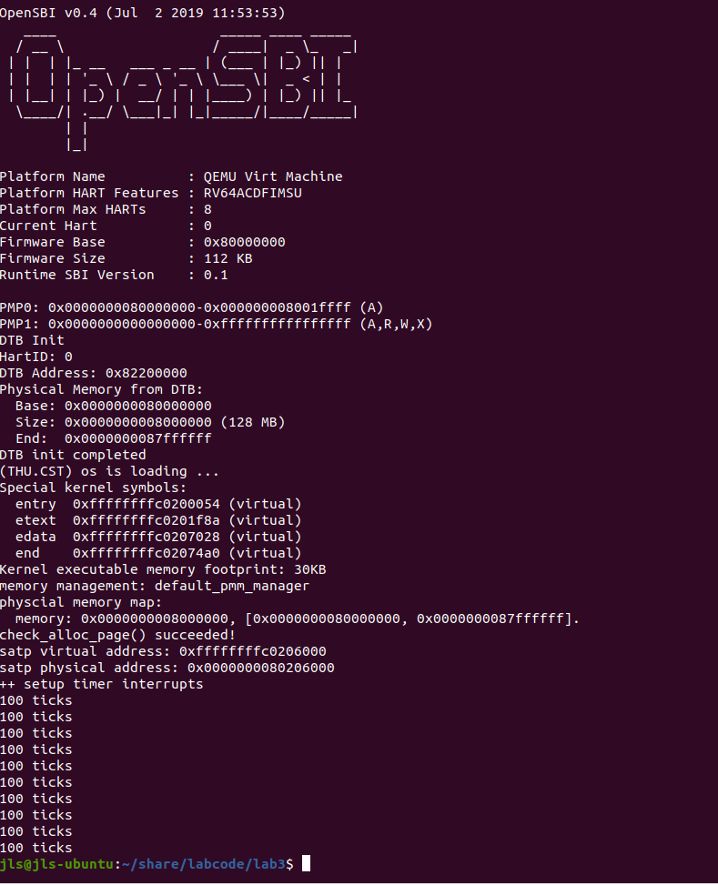
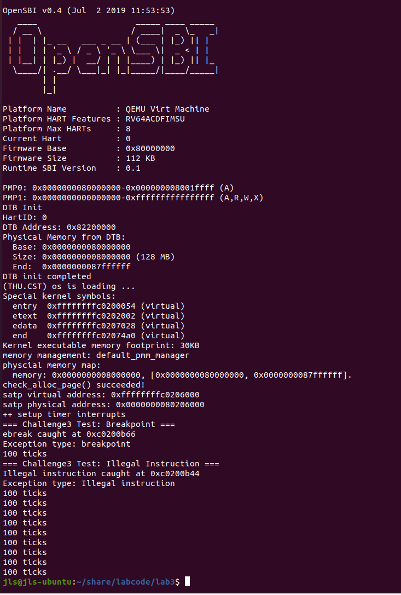

# 实验三：中断与异常处理 实验报告

---

## 一、 实验目的与内容摘要

本次实验的核心目标是理解中断与异常的基本概念，掌握中断处理程序的编写方法，实现异常捕获与处理机制，深入理解操作系统底层机制。

实验内容主要包括：

1. **完善中断处理**：
   * 完善trap.c中的中断处理函数trap，使操作系统每遇到100次时钟中断后，调用print_ticks子程序，向屏幕上打印一行文字”100 ticks”，在打印完10行后调用sbi.h中的shut_down()函数关机。
   * 简要说明实现过程和定时器中断中断处理的流程。
2. **描述与理解中断流程**：
   * 描述ucore中处理中断异常的流程。
3. **理解上下文切换机制**：
   * 理解trapentry.s中的重要汇编代码的作用
4. **完善异常中断**
   * 编程完善在触发一条非法指令异常和断点异常，在 kern/trap/trap.c的异常处理函数中捕获，并对其进行处理，简单输出异常类型和异常指令触发地址

通过本次实验，我们通过实际编程实现中断与异常处理了深入理解操作系统底层运行机制，掌握了中断处理这一操作系统核心功能，为后续的进程管理、内存管理等实验打下坚实基础。

## 二、 知识点梳理

### 2.1 实验知识点与OS原理的对应关系

| 实验中的知识点                             | 对应的OS原理知识点                                                      | 含义与关系                                                                                                                                                                                                                                                                                                                                                                                                                                                                                                                          |
| :----------------------------------------- | :---------------------------------------------------------------------- | :--------------------------------------------------------------------------------------------------------------------------------------------------------------------------------------------------------------------------------------------------------------------------------------------------------------------------------------------------------------------------------------------------------------------------------------------------------------------------------------------------------------------------------------------------------------------------------- |
| 中断处理流程                     | 中断与异常机制	     |实验实现了完整的中断处理流程，验证了原理中的中断响应、保存现场、处理、恢复现场等概念  |
| 上下文保存与恢复    | 进程上下文切换   | 实验通过SAVE_ALL/RESTORE_ALL演示了上下文保存恢复机制，这是进程切换的基础 |
| 时钟中断         | 时间片轮转调度       | 时钟中断是分时操作系统的基础，为后续的进程调度做准备                                                                                            |
| 异常分类处理 | 异常处理机制 | 实验区分了中断和异常，并对不同类型异常进行特定处理    |

### 2.2 OS原理中重要但在实验中未体现的知识点

- **中断优先级**: 真实系统中多种中断源的优先级处理
- **中断屏蔽**: 关键代码段的中断禁用机制
- **下半部处理**: 复杂的中断处理分割机制
- **中断负载均衡**: 多核系统中的中断分配
- **虚拟化支持**: 嵌套虚拟化中的中断处理
- **电源管理**: 中断与系统电源状态的交互

## 三、 练习解答

### 练习1：完善中断处理 （需要编程）

#### 设计实现过程分析

在 kern/trap/trap.c 的 interrupt_handler 函数中，我完成了对时钟中断的处理

、、、
case IRQ_S_TIMER:
    clock_set_next_event();  // (1)设置下次时钟中断
    ticks++;                 // (2)计数器加一
    if (ticks % TICK_NUM == 0) {
        print_ticks();       // (3)每100次输出"100 ticks"
        num++;
        if (num == 10) {
            sbi_shutdown();  // (4)10次后关机
        }
    }
    break;

、、、

#### 定时器中断处理流程
- **中断触发**：时钟硬件产生中断信号
- **保存现场**：CPU自动保存PC到sepc寄存器，跳转到 `__alltraps` 
- **保存上下文**：`SAVE_ALL` 宏保存所有寄存器到栈中
- **中断分发**：`trap_dispatch `根据cause寄存器判断中断类型
- **时钟处理**： 调用 `clock_set_next_event()`设置下一次中断，ticks计数器加1,每100次中断调用 `print_ticks()` 输出信息,输出10次后调用 `sbi_shutdown() `关机
- **恢复现场**：`RESTORE_ALL` 恢复寄存器，sret返回

#### 运行结果

系统成功输出10行"100 ticks"，每行间隔约1秒，最后正常关机。

## 四、 扩展练习 Challenge

### 扩展练习 Challenge1：描述与理解中断流程

#### ucore中断异常处理流程

- **异常产生**：CPU执行指令时发生异常或外部设备产生中断
- **硬件自动保存**：CPU自动保存pc到sepc，保存原因到scause，其他信息到stval等CSR
- **跳转向量**： 根据stvec寄存器跳转到 `__alltraps` 异常处理入口
- **保存上下文**: `SAVE_ALL` 宏保存所有通用寄存器和CSR到栈中
- **调用处理函数**：move a0, sp设置参数，jal trap调用C处理函数
- **中断处理**： 在C语言层面根据中断类型进行相应处理
- **恢复现场**：`RESTORE_ALL` 恢复保存的寄存器
- **返回**: sret指令从异常返回，恢复原来的执行流 

#### mov a0, sp的目的
将当前栈指针sp的值（指向trapframe结构）作为参数传递给trap函数。这样C处理函数就能通过这个指针访问保存的所有寄存器状态

#### SAVE_ALL中寄存器保存位置

寄存器在栈中的位置由sp偏移量和REGBYTES确定：
  * 通用寄存器x0-x31保存在sp+0*REGBYTES到sp+31*REGBYTES
  * sstatus、sepc等CSR保存在sp+32*REGBYTES到sp+35*REGBYTES
  * 每个寄存器占用REGBYTES字节(riscv64中为8字节) 

#### 对于任何中断，__alltraps 中是否需要保存所有寄存器

需要，对于任何中断，__alltraps中都需要保存所有寄存器理由有如下几点：

- **完整性**：确保能够完全恢复中断前的执行状态
- **通用性**：不知道具体哪些寄存器被使用，必须全部保存
- **嵌套中断**：可能发生中断嵌套，需要完整的上下文保存
- **调试支持**：完整的寄存器信息有助于调试

### 扩展练习 Challenge2：理解上下文切换机制

#### csrw sscratch, sp; csrrw s0, sscratch, x0操作分析

这两条指令实现了以下操作：

、、、
csrw sscratch, sp      ; 将当前sp保存到sscratch寄存器
csrrw s0, sscratch, x0 ; 将sscratch的值读入s0，同时将sscratch清零
、、、

目的如下：

- **保存用户指针**：第一条指令将当前栈指针保存到sscratch
- **标记内核态**：第二条指令将sscratch清零，表示当前处于内核模式
- **提供恢复信息**：原栈指针保存在s0中，用于后续恢复

#### store意义分析

虽然在 `RESTORE_ALL`中没有还原stval、scause这些CSR，但store操作仍有如下意义:

- **调试信息**:在异常处理过程中可以查看这些CSR的值，帮助诊断问题
- **嵌套异常处理**：如果发生嵌套异常，这些CSR会被新的异常信息覆盖，需要保存旧值
- **完整性**：保持trapframe结构的一致性，便于统一处理

这些csr之所以不还原是因为 `stval` 包含异常相关信息（如错误地址），处理完后不再需要,`scause` 是异常原因代码，处理完成后不再相关，他们属于"一次性"信息，异常处理完成后就失去意义

### 扩展练习 Challenge3：完善异常中断

#### 实现过程分析

在 `exception_handler` 函数中添加了对非法指令和断点异常的处理：

、、、
case CAUSE_ILLEGAL_INSTRUCTION:
    cprintf("Illegal instruction caught at 0x%08x\n", tf->epc);
    cprintf("Exception type: Illegal instruction\n");
    tf->epc += 4;  // 跳过当前异常指令
    break;

case CAUSE_BREAKPOINT:
    cprintf("ebreak caught at 0x%08x\n", tf->epc);
    cprintf("Exception type: breakpoint\n");
    tf->epc += 4;  // 跳过当前断点指令
    break;

、、、

#### 异常触发方法

在 `interrupt_handler` 的时钟中断处理中触发异常测试：

、、、
if (ticks == 10 && test_phase == 0) {
    test_phase = 1;
    cprintf("=== Challenge3 Test: Breakpoint ===\n");
    asm volatile("ebreak");
}
else if (ticks == 20 && test_phase == 1) {
    test_phase = 2;
    cprintf("=== Challenge3 Test: Illegal Instruction ===\n");
    asm volatile(".word 0x00000000");
}
、、、

#### 运行结果

## 五、实验总结

在本实验我们通过实现时钟中断处理和异常捕获，深入理解了操作系统中断机制的工作原理，掌握了完整的中断处理流程，从硬件触发到软件处理的完整路径，理解了上下文保存恢复的重要性，学会了异常分类处理的方法，针对不同类型异常采取不同策略，实践了安全触发和测试异常的技术，避免系统崩溃。

